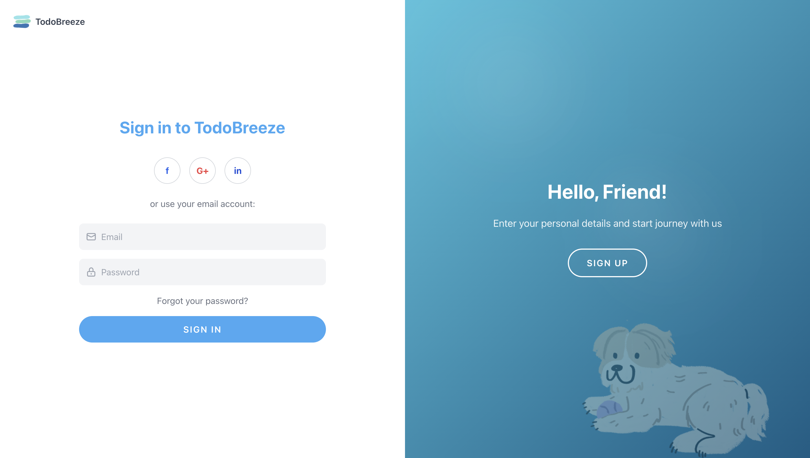
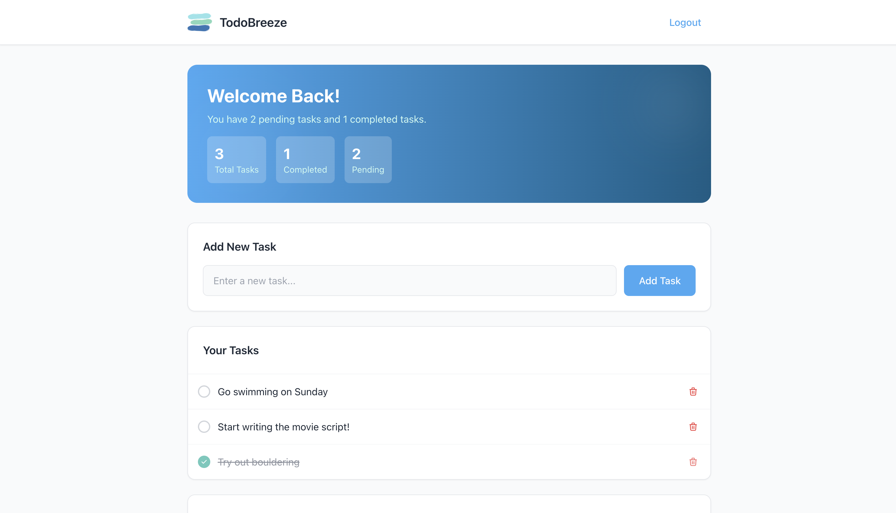
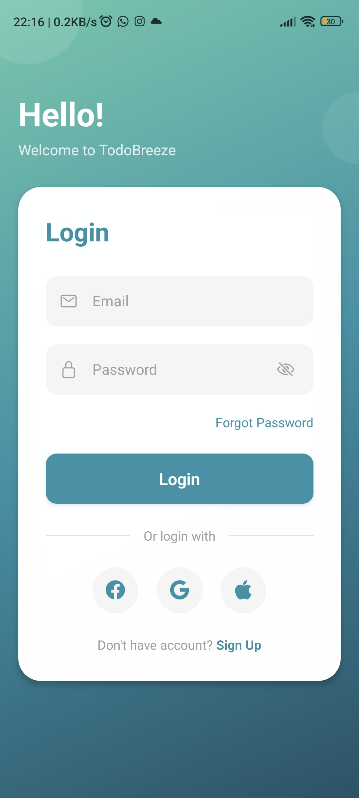
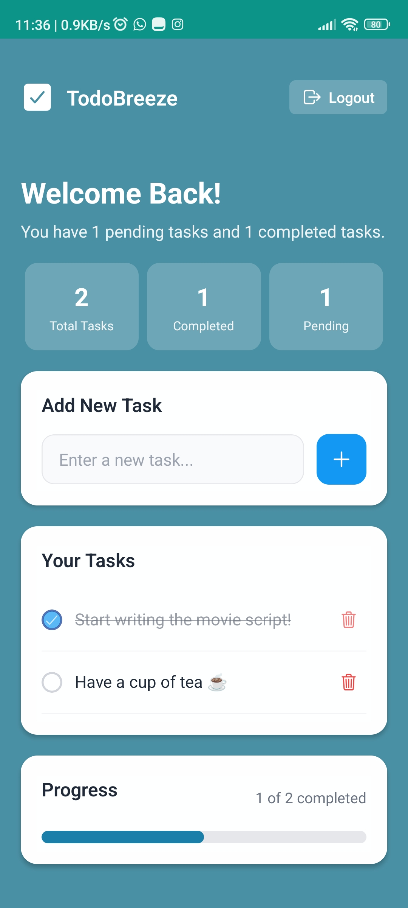
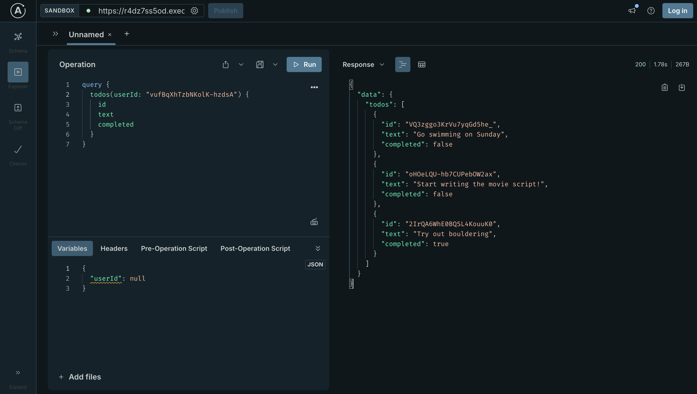

# TodoBreeze - Full Stack Todo Application

A complete todo application ecosystem featuring a GraphQL backend, React web application, and React Native mobile app. Built with modern technologies and deployed across AWS Lambda, Vercel, and Expo.

## Live Demos

- **Web Application**: [https://to-do-website-liard.vercel.app/](https://to-do-website-liard.vercel.app/)
- **GraphQL Playground**: [AWS Lambda GraphQL Endpoint](https://r4dz7ss5od.execute-api.us-east-1.amazonaws.com/dev/graphql)
- **Mobile App (Android)**: [Expo Installation Link](https://expo.dev/accounts/aphyueh/projects/to-do-mobile-app/builds/f8919be9-a701-4897-bd82-e56d5b797d0e)


## Screenshots

### Web Application



### Mobile Application



### Backend Graphql (AWS)



## Architecture Overview

This project follows a modern full-stack architecture with clear separation of concerns:

```
┌─────────────────┐    ┌─────────────────┐
│   Web Client    │    │  Mobile Client  │
│   (React)       │    │ (React Native)  │
│   Vercel        │    │   Expo Go       │
└─────────┬───────┘    └─────────┬───────┘
          │                      │
          └──────────┬───────────┘
                     │
            ┌────────▼────────┐
            │  GraphQL API    │
            │  Apollo Server  │
            │  AWS Lambda     │
            └────────┬────────┘
                     │
            ┌────────▼────────┐
            │   Data Store    │
            │  AWS S3 Bucket  │
            │ (database.json) │
            └─────────────────┘
```

### Architecture Decisions

1. **GraphQL over REST**: Chosen for efficient data fetching, strong typing, and single endpoint simplicity
2. **Serverless Backend**: AWS Lambda provides cost-effective scaling and zero server management
3. **File-based Storage**: Simple S3-based JSON storage for rapid prototyping (suitable for demo, would use DynamoDB for production)
4. **Apollo Client**: Unified state management and caching across both frontend applications
5. **Monorepo Structure**: Using submodules for organized code sharing while maintaining deployment independence

## Tech Stack

### Backend (`to-do-backend`)
- **Runtime**: Node.js 18.x
- **API**: Apollo Server (GraphQL)
- **Deployment**: AWS Lambda + Serverless Framework
- **Storage**: AWS S3 (JSON file-based)
- **Authentication**: Dummy auth (email/password)

### Web Frontend (`to-do-web`)
- **Framework**: React with Create React App
- **Styling**: Tailwind CSS
- **State Management**: Apollo Client
- **Deployment**: Vercel (auto-deploy from GitHub)

### Mobile Frontend (`to-do-mobile-app`)
- **Framework**: React Native + Expo
- **Navigation**: React Navigation
- **State Management**: Apollo Client + AsyncStorage
- **Deployment**: Expo Application Services (EAS)

## Quick Start

### Prerequisites
- Node.js (v14+)
- Git
- AWS CLI (for backend deployment)
- Expo CLI (for mobile development)
- Mobile device with Expo Go app

### Setup Instructions

1. **Clone the repository with submodules**:
   ```bash
   git clone --recursive https://github.com/aphyueh/todo-app.git
   cd todo-app
   ```

2. **Backend Setup** (Optional - already deployed):
   ```bash
   cd to-do-backend
   npm install
   cp .env.example .env  # Configure S3_BUCKET
   mode index.js         # Run locally using lowdb
   # OR
   serverless deploy     # Deploy to AWS
   ```

3. **Web Application Setup**:
   ```bash
   cd to-do-web
   npm install
   # Update GraphQL endpoint in apollo/provider.js
   npm start            # Runs on http://localhost:3000
   ```

4. **Mobile Application Setup**:
   ```bash
   cd to-do-mobile-app
   npm install
   # Update GraphQL endpoint in apollo/client.js
   npx expo start       # Start development server
   ```

### Using the Live Applications

#### Web Application
Visit [https://to-do-website-liard.vercel.app/](https://to-do-website-liard.vercel.app/) and:
1. Sign up with any email and password (dummy for now)
2. Start managing your todos!

#### Mobile Application
**Option 1**: Scan the QR code above with your camera app
**Option 2**: Visit the [Expo installation link](https://expo.dev/accounts/aphyueh/projects/to-do-mobile-app/builds/f8919be9-a701-4897-bd82-e56d5b797d0e)

Both will install the app on your Android device.

## Features

### Core Functionality
- ✅ User registration
- ✅ Create, read, update, delete todos
- ✅ Toggle todo completion status
- ✅ Progress tracking with visual indicators
- ✅ Real-time data synchronization

### Technical Features
- 🔄 GraphQL API with Apollo Server
- 📱 Cross-platform mobile app (React Native)
- 🌐 Responsive web application
- ☁️ Serverless backend deployment
- 💾 Offline support with client-side caching
- 🎨 Modern UI/UX with Tailwind CSS

## Development Timeline

| Component | Time Invested | Key Challenges |
|-----------|---------------|----------------|
| **Backend** | **2 hours** | Setting up serverless GraphQL, S3 integration |
| **Website** | **3 hours** | Responsive design, Apollo Client setup |
| **Mobile App** | **3 hours** | React Native navigation, Expo deployment |
| **Total** | **8 hours** | Integration testing, documentation |

### Development Process
1. **Backend First**: Established GraphQL schema and AWS deployment
2. **Web Development**: Built responsive React app with Tailwind
3. **Mobile Development**: Created React Native app with Expo
4. **Integration**: Connected all clients to deployed backend
5. **Deployment**: Set up CI/CD for web (Vercel) and mobile (EAS)

## GraphQL API

### Schema Overview
```graphql
type User {
  id: ID!
  name: String!
  email: String!
}

type Todo {
  id: ID!
  text: String!
  userId: ID!
  completed: Boolean!
}

type Query {
  users: [User]
  todos(userId: ID!): [Todo]
}

type Mutation {
  signup(name: String!, email: String!, password: String!): User
  login(email: String!, password: String!): User
  addTodo(userId: ID!, text: String!): Todo
  deleteTodo(id: ID!): Boolean
  toggleTodoCompleted(id: ID!): Todo
}
```

### Example Usage
```graphql
# Login
mutation {
  login(email: "user@example.com", password: "password") {
    id
    name
    email
  }
}

# Add Todo
mutation {
  addTodo(userId: "user123", text: "Complete project") {
    id
    text
    completed
  }
}

# Get Todos
query {
  todos(userId: "user123") {
    id
    text
    completed
  }
}
```

### Sample database
```json
{
  "users": [
    {
      "id": "YZUQU93Ah2yuSPwo3nLQs",
      "name": "Cillian",
      "email": "charles@gmail.com"
    },
    {
      "id": "vufBqXhTzbNKolK-hzdsA",
      "name": "Murphy",
      "email": "murphy@gmail.com"
    },
  ],
  "todos": [
    {
      "id": "C5fdFXDxta0fdeGv3wOgu",
      "text": "Fix mobile app",
      "userId": "YZUQU93Ah2yuSPwo3nLQs",
      "completed": false
    },
    {
      "id": "VQ3zggo3KrVu7yqGd5he_",
      "text": "Go swimming on Sunday",
      "userId": "vufBqXhTzbNKolK-hzdsA",
      "completed": false
    },
    {
      "id": "oHOeLQU-hb7CUPebOW2ax",
      "text": "Start writing the movie script!",
      "userId": "vufBqXhTzbNKolK-hzdsA",
      "completed": false
    },
    {
      "id": "2IrQA6WhE0BQSL4KouuK0",
      "text": "Try out bouldering",
      "userId": "vufBqXhTzbNKolK-hzdsA",
      "completed": true
    },
  ]
}
```

## Project Structure

```
todobreeze/
├── to-do-backend/           # GraphQL API (AWS Lambda)
│   ├── lambda.js            # Apollo Server setup
│   ├── serverless.yml       # AWS deployment config
│   └── package.json
├── to-do-web/               # React web application
│   ├── src/
│   │   ├── pages/           # React components
│   │   ├── apollo/          # GraphQL client setup
│   │   └── assets/          # Images and styles
│   └── package.json
├── to-do-mobile-app/        # React Native mobile app
│   ├── screens/             # App screens
│   ├── apollo/              # GraphQL client setup
│   ├── assets/              # Images and icons
│   └── package.json
└── README.md                # This file
```

## Future Enhancements

- **Security**: Implement JWT authentication and password hashing
- **Database**: Migrate from S3 file storage to DynamoDB
- **Features**: Add due dates, categories, and task priorities
- **Mobile**: iOS support and app store deployment
- **Real-time**: WebSocket subscriptions for live updates
- **Testing**: Comprehensive unit and integration tests

## Author

**Amber Pang**
- GitHub: [@aphyueh](https://github.com/aphyueh)
- Backend: [to-do-backend](https://github.com/aphyueh/to-do-backend)
- Website: [to-do-web](https://github.com/aphyueh/to-do-web)
- Mobile: [to-do-mobile-app](https://github.com/aphyueh/to-do-mobile-app)

---

